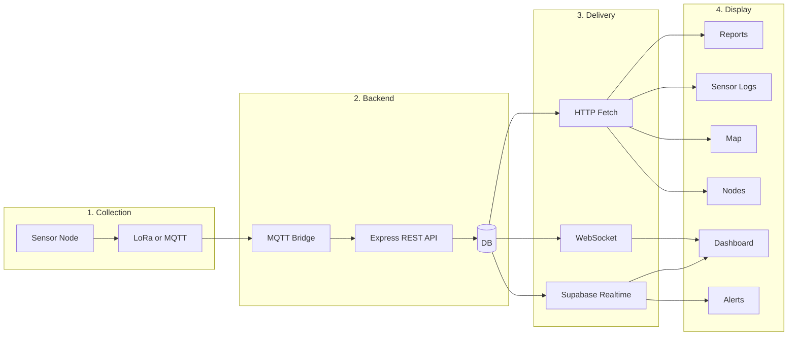
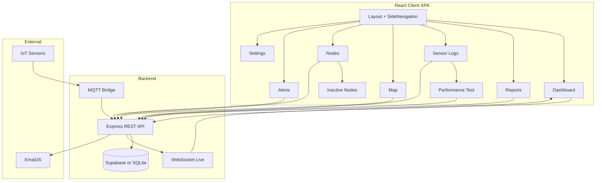
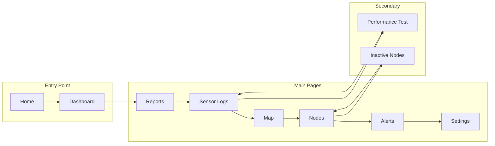
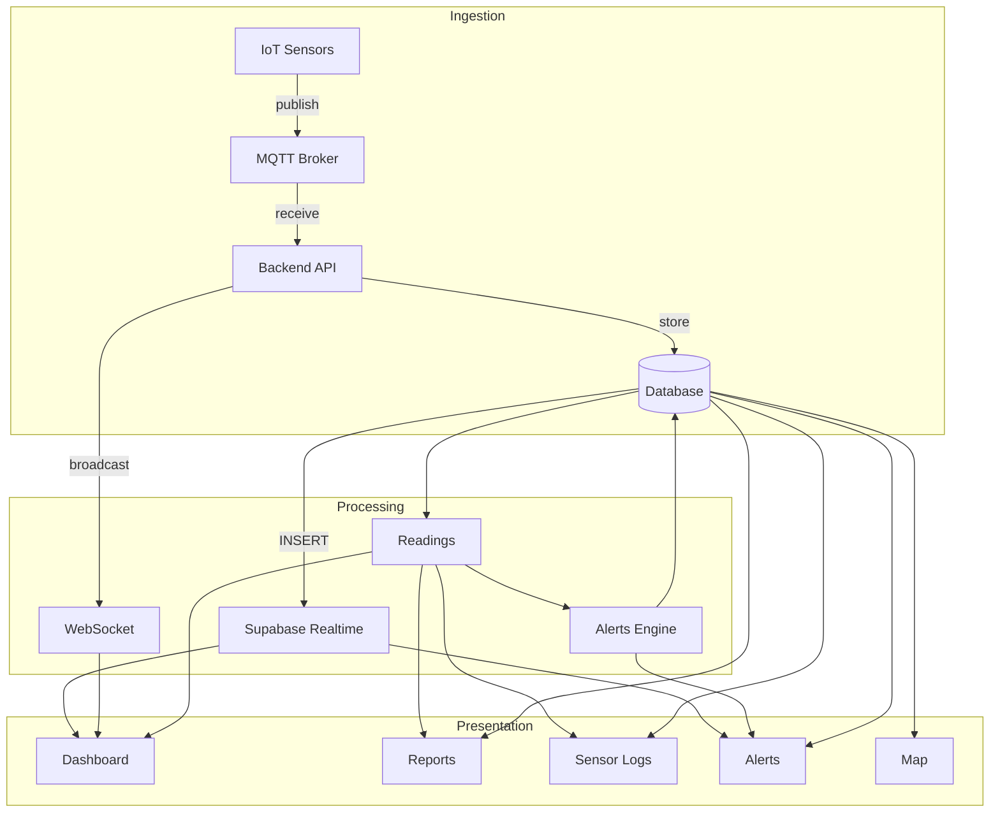
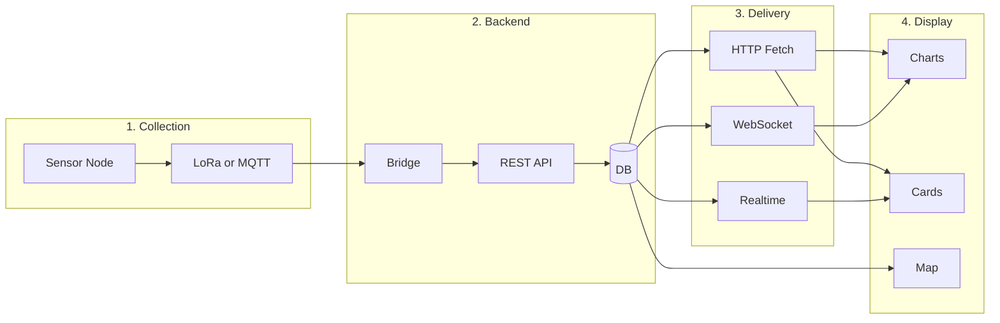

# WQMS Overall Process Flow

> **Tip:** If you get "No diagram type detected", your tool may be parsing the whole file. Use the standalone diagram files in `docs/diagrams/` (e.g. `00-overall-flowchart.mmd`) and paste their contents into [mermaid.live](https://mermaid.live) or a Mermaid renderer that accepts a single diagram.

## Overall Flow

End-to-end view from sensor collection through backend processing and delivery to the UI display.

---

## System Architecture

---

## User Navigation Flow

---

## Data Process Flow

---

## Sensor-to-Dashboard Pipeline

---

## Test Run Data Flow

Test Run Detail Modal shows IoT Performance and Alert Responsiveness for a given test run. Data is always fetched from Supabase—no generation during tests. Data arrives in Supabase from one of two sources:

1. **Real LoRa path:** Sensor node → LoRa → Forwarder → MQTT (HiveMQ) → Bridge → Supabase  
2. **Test scenarios path:** `test.js` / `run-random-scenarios.js` → MQTT (HiveMQ) → Bridge → Supabase  

**Important:** The Express server does **not** write sensor readings to the database. Only `bridge.js` writes to Supabase. You must run the bridge for data to be stored.

### Required process order

1. **Start the bridge:** `cd server && npm run bridge` (or `node bridge.js`). Wait for "Subscribed to water-quality/#".
2. **Start the server (API):** For the REST API and Performance Test UI: `cd server && npm start`.
3. **Start a test run:** From the Performance Test page, click "Start test run" with desired interval and duration. The server publishes `test_start` to MQTT; the bridge receives it and sets `activeTestRunContext` so incoming packets are tagged with `test_run_id`.
4. **Provide packet data (choose one):**
   - Run test scenarios: `node scripts/run-random-scenarios.js --minutes 5` (or `node scripts/test.js --scenario <name>`).
   - Or have real LoRa nodes transmit during the run window.

Packets published to MQTT during the active test run window will be tagged with `test_run_id` by the bridge and stored in Supabase. The Test Run Detail Modal fetches from Supabase by `test_run_id`—no on-the-fly generation.
